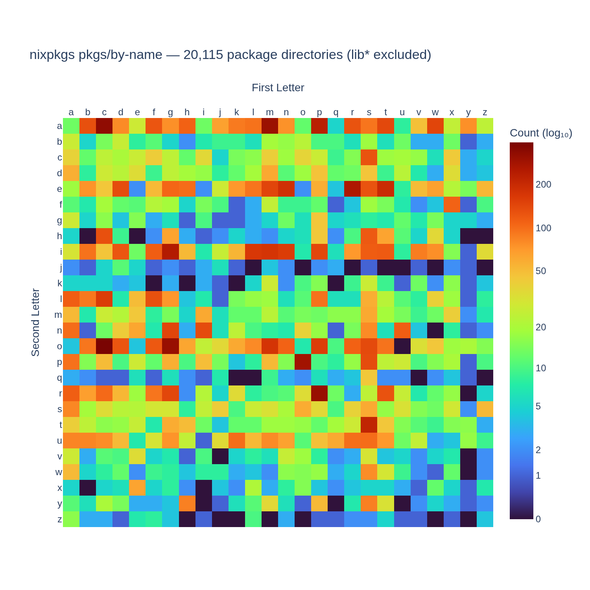

# nixpkgs-stats

Visualize the distribution of packages in a [nixpkgs](https://github.com/NixOS/nixpkgs) repository.

Scans `pkgs/by-name/` and renders a heatmap showing how many packages fall under each 2-letter prefix — first letter on the x-axis, second letter on the y-axis.

## Features

- Point at any nixpkgs checkout (fork, tag, commit) on disk
- Toggle between counting **package directories** or **all `.nix` files**
- **Logarithmic color scale** for better contrast when one prefix dominates
- Optional **exclusion of `lib*` packages** in the `li/` prefix
- Interactive Plotly heatmap with hover tooltips and zoom

## Usage

```bash
uv run streamlit run scripts/app.py
```

1. Enter the path to a nixpkgs repo
2. Adjust options in the sidebar
3. Click **Scan**

## Example



*Above: nixpkgs with 20,115 package directories (lib\* excluded, log scale). The density in `li/` drops from ~1,145 to ~167 when `lib*` packages are filtered out.*

## Dependencies

- [streamlit](https://streamlit.io/) — web UI
- [plotly](https://plotly.com/) — interactive charts
- [pandas](https://pandas.pydata.org/) — data handling
- [numpy](https://numpy.org/) — log transforms
- [kaleido](https://github.com/nicolaskruchten/kaleido) — static image export
